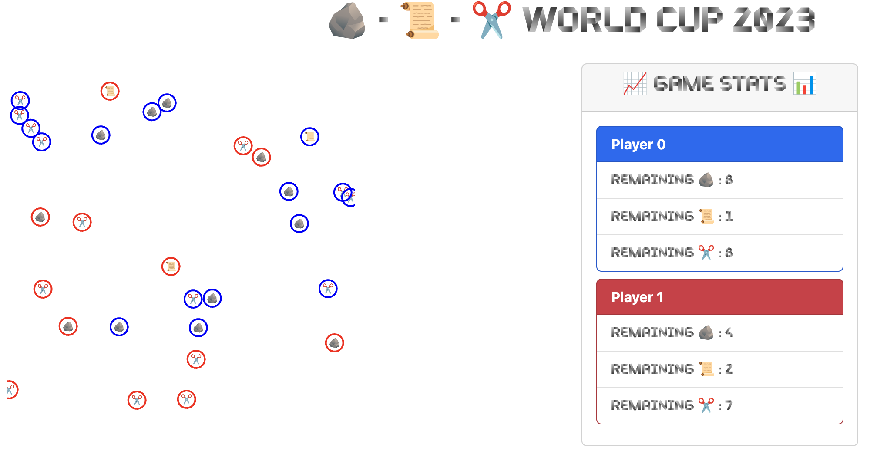

# Rock-Paper-Scissors World Cup Game
This is a rock-paper-scissors multiplayer game. The players move their agents (rocks,
papers and scissors) on a 2D playing field. A classical rock-paper-scissors fight
takes place upon collision of two agents.



## Change Log
### [July 11th, 2024]
Fixed bug, where player nicknames did not show up unless the page was reloaded.

### [June 7th, 2024]
Added nicknames to the game. Old clients will no longer work!

### [June 27th, 2023]
Changed the maximally allowed delay for a player move to 100 ms and
the maximum speed to 1. Furthermore, fixed a bug in the C++ client, that caused
no messaged to be transmitted to the server, despite a valid move.

## Installation
In order to install the framework on your machine, you need Python (>3.3) and PIP
(package manager) installed on your system. Furthermore, it is recommended using
GIT locally to clone the repository. Tutorials on how to do that are everywhere
on the internet.

Start by opening a terminal (or PowerShell on Windows) and navigate to the directory,
where you want the project to reside. Then clone this repository using
```
$ git clone https://github.com/ISCOTTYI/rock-paper-scissors.git
```
Alternatively you can download a ZIP from the green `<> Code` button.

It is highly recommended using a virtual environment to install
the framework. There are different tools available to create a virtual environment,
however here we will just use the [one included in python's standard library](https://docs.python.org/3/library/venv.html).
From the terminal (or PowerShell on Windows) run
```
$ python3 -m venv ./venv
```
and then on Linux / MacOS
```
$ source venv/bin/activate
```
or on Windows in PowerShell
```
PS C:\> venv\Scripts\Activate.ps1
```
You should now have a `(venv)` in front of your prompt. Now install the
requirements for the framework using
```
$ pip install -r requirements.txt
```

### Troubleshooting
* If calling
  ```$ python3```
  does not open the python console, try `python` or `python3x` (`x` being the version
  of python you have installed) instead. If none of that works, but you have Python
  installed on your machine, it's likely a problem with your `PATH` variable. You
  can find solutions online.
* The framework and in particular the webpage needs an internet connection to function
  properly.

## Getting Started
To test your installation, you can try to run the example client. In your terminal run
```
$ python server.py
```
and go to `127.0.0.1:8080` in your browser. Then, in a separate terminal, run
```
$ python client/test_client.py
```
and you should see a client with a couple agents appearing on the webpage. In a third
terminal window you might want to also try running a second instance of the `test_client.py`.
This should start a game between the two `test_client.py`s.
### Playing the Game
To play the game you have to modify the clients in the `client` directory.
Clients in C++ and Python are included. If you want to play in any other programming
language, you will have to write your own client from scratch (see [Technical Details](#technical-details)).

Start by setting a creative nickname, by changing the `NICKNAME` variable in
your client. On the technical level you will have a player ID which is
stored in the `PLAYER_ID` variable.

The game is played in rounds. In each round, one player makes one move (moveing all its
agents). Then, in the next round, it's the next players turn to make a move. At the
start of a round the player receives the current game state and the current round
and calculates his move from that information, which is then returned.
The game state is transmitted as a string encoded [JSON](https://www.w3schools.com/whatis/whatis_json.asp) object.
Consider a game in round 15 with two players with respective player IDs 0 and 1, where each player
has two agents, then the game state would look something like this:
```
"{"round": 15, "0": [[23, "0", 10.2, 12.3], [12, "2", 300.2, 76.3]], "1": [[15, "2", 30.2, 120.3], [2, "1", 350.2, 68.3]]}"
```
The agents are encoded as a 4-tuple, e.g. `[23, "0", 10.2, 12.3]`, where the
first entry is the unique agent ID, the second entry tells if the particular
agent is a rock (`"0"`), paper (`"1"`) or scissor (`"2"`) and the third and
fourth entry denote the coordinates of the agent. The playing field is a 400 by
400 pixel area with periodic boundary conditions. From this game state the
player now calculates the moves of its own agents. The own player ID and other
useful constants such as the playing field size and the radius of the agents are
preset in the client templates. Each agent is moved by specifying a speed
(between 0 and 0.1) and a polar angle (between 0 and 2π). The move is return
again as a string encoded JSON object, e.g.
```
"{"round": 15, "moves": [[23, 0.09, 3.4596], [12, 0.1, 1.2349]]}"
```
Notice, that the round must also be returned with the move. In `"moves"`, the
player specifies the ID of the agent that shall be moved as well as the speed
and polar angles for each of its agents. Make sure that the format of the
returned move matches the one above and that the transmitted round number
matches the one that was received in the game state.

In order to ensure that the game runs sufficiently smooth, each player only has
a fixed time of 10 ms per move. If the server did not receive a response from the
client within this time, the move will simply be skipped and the server will output
a warning to the console.

In the provided C++ and Python clients, the communication with the server is already
handled. A function `make_move(game_state)` is provided, which you should implement.
The game state is available through the argument. Returning a move, as described above,
from the function suffices to play the game.

### Troubleshooting
* **There is a good chance that you encounter bugs in the framework. Please let us know
  if you see something fishy.**
* If there are problems with the game, the first place to check is the console output of
  `server.py`.
* In `server.py` you may also activate richer console output by running the server
  with the `--debug` flag, i.e. using
  ```
  $ python server.py --debug
  ```
  It may also help to print the received
  game state and your response (moves) to the console in your client implementation.
* Make sure that the format of the returned moves matches the format above.
* If a client is accidentally disconnected or there is other unwanted behavior it
  is normally necessary to restart the server.
* If you compile your C++ code on Windows, problems with the TCP sockets may arise.
  To solve these problems, either do the right thing and install Linux on your
  machine (bootable or via WSL), or just use a UNIX-like compiler such as
  [MinGW](https://mingw.osdn.io/).

## Technical Details
The players communicate with the game via TCP (game server). The game is visualized
on a website. The web server and the game server run asynchronously and are both
controlled by `server.py`. The game logic is fully handled by the server side.
The client socket continuously listens for an updated game state. Upon receive the
game state is processed and moves are sent back to the server. 

<!-- ## TODO
- [x] `Player.make_move()` error catching
- [x] C++ client
  - [x] Basic communication
  - [x] Parse JSON
  - [x] Needs a `readline()` from TCP stream (buffering) (DONE?)
  - [ ] Is receive too slow?
- [x] Parse player response, should not modify whole game state
- [x] Player response rules
- [x] BUG: Website does not update when players join
- [ ] Fix the framerate of the game, i.e. make sure that every move takes the same time regardless of player response times.
- [x] Make sure that the client is automatically assigned its ID
- [x] Color Code Player Agents
- [x] What if only one kind remains?
- [ ] Change game state format such that it is easier to count rocks, papers, scissors -->
